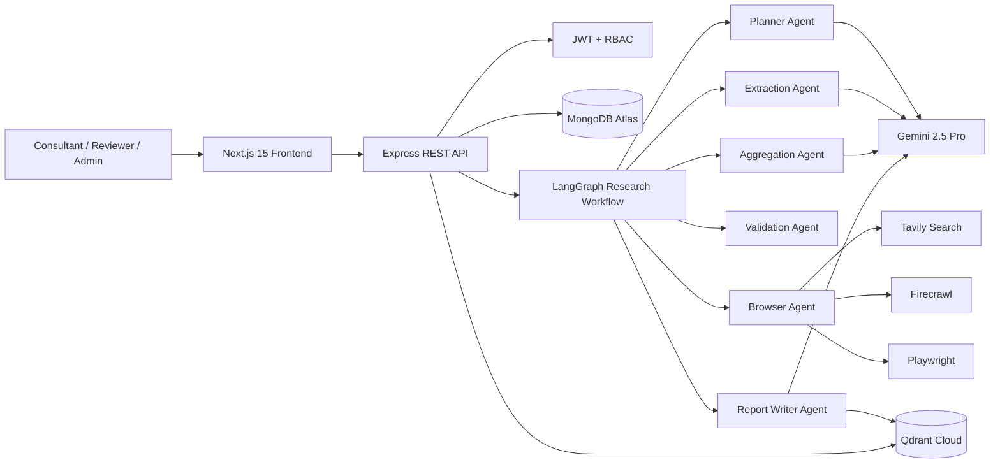

# Architecture

The backend is the workflow authority. The frontend never fabricates operational metrics; dashboards are MongoDB aggregations over jobs, evidence, sources, reports, validations, and audit logs.

## Governance

- Plans must be approved before execution.
- Evidence records preserve source relationships and confidence scores.
- Reviewers and admins can approve, reject, or flag evidence.
- Audit logs capture authentication, plan approvals, job creation, and evidence decisions.
- Knowledge memory stores validated findings locally and, when configured, in Qdrant collections.
