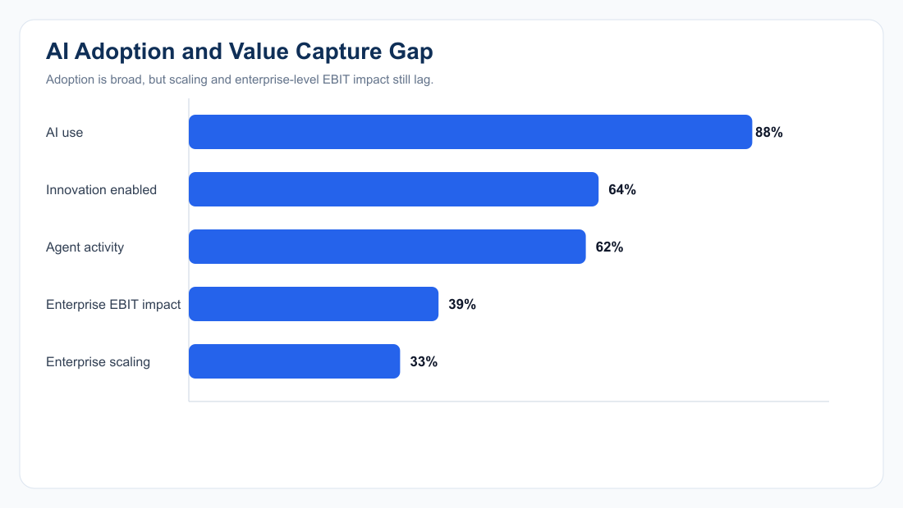
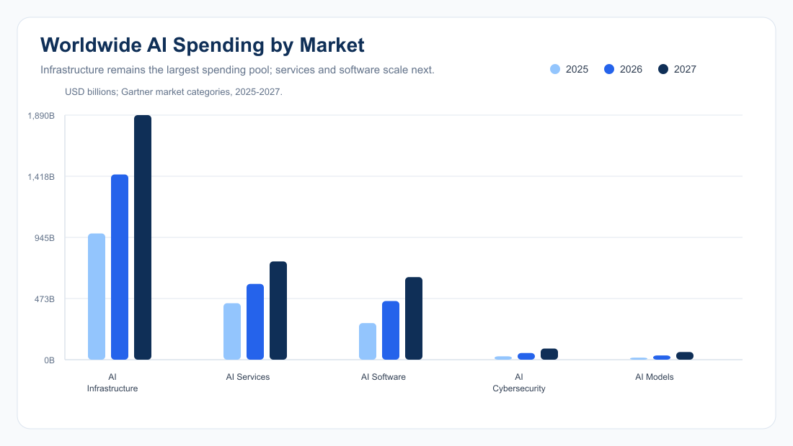
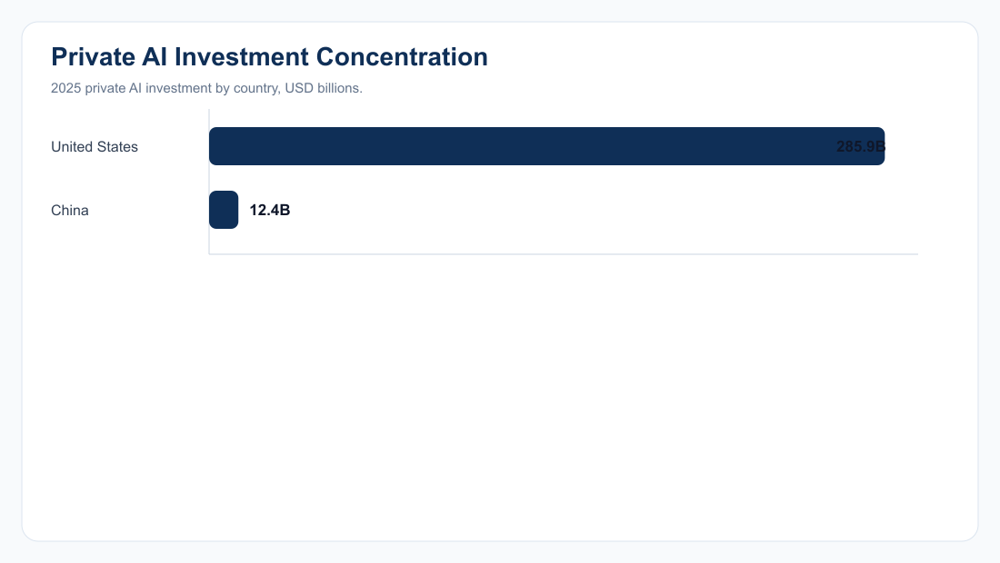
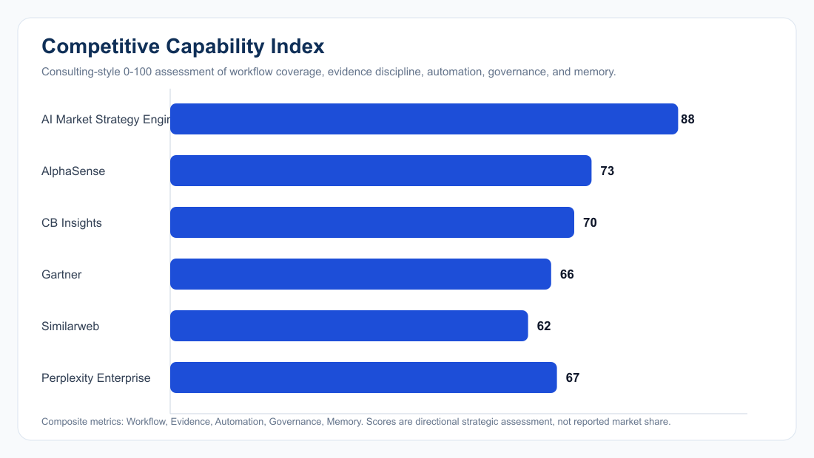
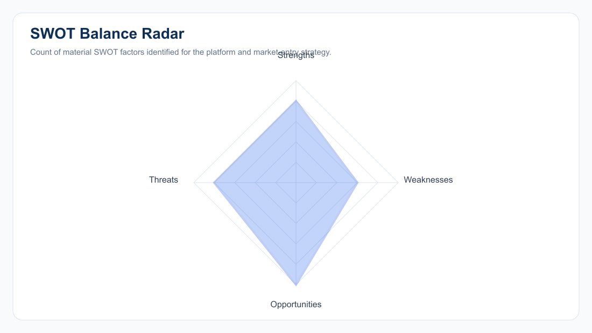
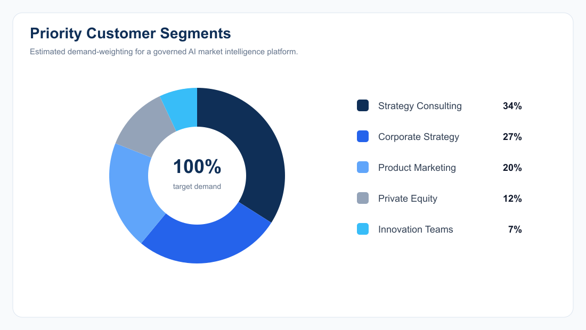
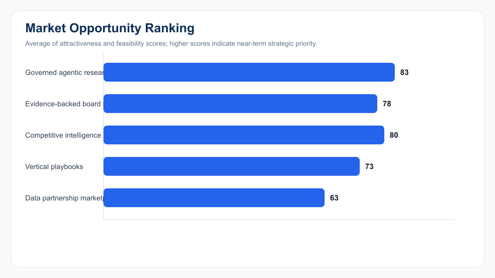
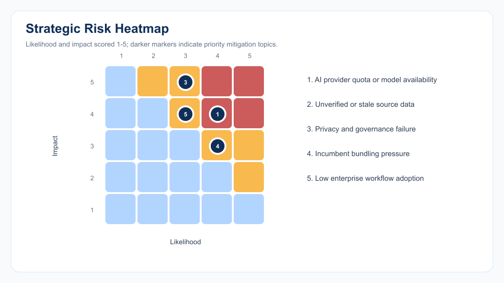
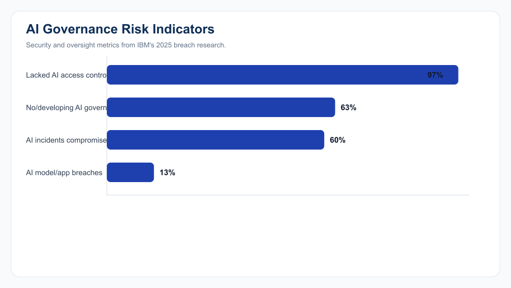

# AI Market Strategy Engine

## Executive Market Intelligence, Competitive Strategy, and Growth Roadmap

**Date:** August 7, 2026  
  
**Company / Project:** AI Market Strategy Engine Project  
  
**Prepared for:** Executive strategy review  
  
**Theme:** Blue / white / gray consulting report

\newpage

## Table of Contents

- [Executive Summary](#executive-summary)
- [Market Overview](#market-overview)
- [Industry Trends](#industry-trends)
- [Competitor Analysis](#competitor-analysis)
- [SWOT Analysis](#swot-analysis)
- [Customer Insights](#customer-insights)
- [Market Opportunities](#market-opportunities)
- [Risk Analysis](#risk-analysis)
- [AI-generated Strategic Recommendations](#ai-generated-strategic-recommendations)
- [Interactive Charts](#interactive-charts)
- [Data Tables](#data-tables)
- [References](#references)
- [Appendix](#appendix)

\newpage

## Executive Summary

### Board-Level Takeaways

| Decision Topic | Executive View | Implication |
|---|---|---|
| Market timing | AI spend and adoption are accelerating sharply, but value capture is uneven. | Prioritize use cases that close the evidence-to-decision gap, not generic AI productivity. |
| Strategic wedge | The engine's strongest position is governed, source-backed research automation for consultants and corporate strategy teams. | Lead with workflow governance, auditability, and reusable research memory. |
| Competitive position | Incumbents are strong in content, data, and advisory brands; the project differentiates through end-to-end agentic workflow orchestration. | Build defensibility around evidence lineage, validation, reviewer approvals, and Qdrant-backed memory. |
| Risk posture | AI governance and security gaps are material market concerns. | Productize trust controls as core functionality, not compliance afterthoughts. |
| Recommended stance | Proceed with focused commercialization around enterprise strategy workflows. | Target high-value teams with repeatable research cadences and board-facing outputs. |

### KPI Snapshot

> **AI spending growth, 2026: 47%** - Gartner forecast for worldwide AI spending growth

> **Worldwide AI spend, 2026: $2.59T** - Gartner forecast; vendor and hyperscaler dominated

> **Organizations using AI: 88%** - McKinsey 2025 survey, regular use in at least one function

> **Agentic AI activity: 62%** - McKinsey respondents experimenting with or scaling AI agents

> **Enterprise EBIT impact: 39%** - McKinsey respondents reporting EBIT impact at enterprise level

> **U.S. private AI investment: $285.9B** - Stanford AI Index 2026, 2025 investment

> **Average breach cost: $4.44M** - IBM Cost of a Data Breach Report 2025

> **AI governance gap: 63%** - IBM: breached organizations without or still developing AI governance

**Sources:** [README](../README.md) | [Architecture](../docs/ARCHITECTURE.md) | [McKinsey State of AI](https://www.mckinsey.com/capabilities/quantumblack/our-insights/the-state-of-ai) | [Gartner AI Spending](https://www.gartner.com/en/newsroom/press-releases/2026-05-19-gartner-forecasts-worldwide-ai-spending-to-grow-47-percent-in-2026)

## Market Overview

### Market Definition

The relevant market is the intersection of:

| Layer | Description | Buying Trigger |
|---|---|---|
| AI research automation | Agentic workflows that plan, search, extract, validate, aggregate, and draft research. | Faster strategy cycles and analyst leverage. |
| Market intelligence platforms | Competitive, customer, trend, and market signal monitoring. | Need for source-backed decisions and repeatable tracking. |
| Consulting enablement | Executive-ready outputs, evidence review, audit trail, and reusable knowledge. | Need for board-quality deliverables with governance. |

### Market Scale Signals

| Metric | Value | Interpretation |
|---|---:|---|
| Worldwide AI spending forecast, 2026 | $2.59T | Large budget pool, with infrastructure leading but enterprise applications accelerating. |
| AI spending growth, 2026 | 47% | Demand is expanding faster than most enterprise software categories. |
| AI infrastructure spending, 2026 | $1.43T | Compute-heavy ecosystem creates opportunity for workflow tools that prove ROI. |
| AI services spending, 2026 | $585.5B | Consulting and implementation budgets remain meaningful adoption channels. |
| Organizations using AI in at least one function | 88% | Adoption is mainstream; differentiation shifts to value capture and governance. |

**Sources:** [Gartner AI Spending](https://www.gartner.com/en/newsroom/press-releases/2026-05-19-gartner-forecasts-worldwide-ai-spending-to-grow-47-percent-in-2026) | [Stanford AI Index 2026](https://hai.stanford.edu/ai-index/2026-ai-index-report) | [McKinsey State of AI](https://www.mckinsey.com/capabilities/quantumblack/our-insights/the-state-of-ai)

## Industry Trends

| Trend | Evidence Signal | Strategic Meaning |
|---|---|---|
| Agentic workflows move from pilots to operations | 62% of McKinsey respondents are experimenting with or scaling AI agents. | Workflow orchestration becomes the enterprise buying frame. |
| Value capture lags adoption | 88% regular AI use versus 39% enterprise-level EBIT impact. | Buyers will reward tools that connect AI output to measurable decisions. |
| AI infrastructure arms race continues | Gartner forecasts infrastructure as the largest AI spending category through 2027. | SaaS tools must show clear leverage on expensive AI consumption. |
| Frontier-model competition compresses | Stanford reports the U.S.-China performance gap has effectively closed. | Product differentiation cannot depend only on model access. |
| Responsible AI becomes a commercial requirement | Stanford reports documented AI incidents rose from 233 in 2024 to 362. | Governance, validation, and audit logs should be core selling points. |

### Implications for the Project

- Make evidence quality, reviewer approval, and source lineage visible in every workflow.
- Position the engine as a decision system for strategy work, not only a chatbot or dashboard.
- Package repeatable playbooks by use case: competitor monitoring, market entry, customer segmentation, investment thesis, and risk tracking.

**Sources:** [Stanford AI Index 2026](https://hai.stanford.edu/ai-index/2026-ai-index-report) | [McKinsey State of AI](https://www.mckinsey.com/capabilities/quantumblack/our-insights/the-state-of-ai) | [Gartner AI Spending](https://www.gartner.com/en/newsroom/press-releases/2026-05-19-gartner-forecasts-worldwide-ai-spending-to-grow-47-percent-in-2026)

## Competitor Analysis

### Competitive Landscape

| Competitor / Archetype | Core Strength | Relative Gap | Strategic Response |
|---|---|---|---|
| AI Market Strategy Engine | End-to-end governed research workflow, validation, memory, and reports. | Needs external brand credibility and production usage proof. | Demonstrate repeatable outcomes and evidence quality. |
| AlphaSense | Enterprise content discovery and financial research workflows. | Less differentiated in custom agentic research orchestration. | Emphasize planning-to-report workflow automation. |
| CB Insights | Startup, market, and technology intelligence data. | Dataset-led rather than custom research-agent workflow-led. | Partner or integrate where structured external data matters. |
| Gartner | Brand authority, analyst trust, executive advisory. | High-cost advisory model with less self-serve workflow automation. | Compete on speed, customization, and evidence traceability. |
| Similarweb | Digital traffic and competitive web analytics. | Strong signal data, narrower strategy-reporting workflow. | Integrate digital demand signals into broader strategy views. |
| Perplexity Enterprise | Fast answer generation and source discovery. | Less specialized for governed consulting deliverables. | Differentiate on review, audit, workflow state, and reusable knowledge. |

### Win Themes

- **Workflow depth:** Intake, planning, approval, browsing, extraction, validation, aggregation, report writing, and feedback.
- **Evidence discipline:** Source records, confidence scores, validation results, and reviewer decisions.
- **Memory advantage:** Qdrant-backed knowledge memory for reusable market insights and competitor movements.
- **Executive packaging:** Dashboards and report-generation surfaces built for consulting-grade outputs.

**Sources:** [README](../README.md) | [Architecture](../docs/ARCHITECTURE.md) | [Assistant Controller](../backend/src/controllers/assistant.controller.js)

## SWOT Analysis

| Strengths | Weaknesses |
|---|---|
| Governed multi-agent research workflow. | External market data still requires source validation. |
| Evidence records, confidence scores, reviewer actions, and audit logs. | AI provider quota and availability dependency. |
| Qdrant-backed reusable market memory. | Needs clear production proof points and customer benchmarks. |
| Broad dashboard modules: market, competition, SWOT, forecasting, evidence review, and reports. | Integrations and data partnerships are still a scale requirement. |

| Opportunities | Threats |
|---|---|
| Agentic research automation for strategy teams. | Incumbents can bundle AI into existing research subscriptions. |
| Evidence-backed board and investment committee reporting. | Trust failures from unverified or outdated sources. |
| Vertical research playbooks by industry. | Regulatory, privacy, and model governance expectations are rising. |
| Competitive intelligence memory and monitoring. | Buyer fatigue if AI value is not tied to measurable outcomes. |
| Governance-led AI adoption enablement. | Model/API cost volatility and quota constraints. |

**Sources:** [README](../README.md) | [Architecture](../docs/ARCHITECTURE.md) | [IBM Cost of a Data Breach](https://www.ibm.com/reports/data-breach)

## Customer Insights

### Primary Buyer Segments

| Segment | Estimated Demand Share | Need State | Purchase Driver |
|---|---:|---|---|
| Strategy consulting | 34% | Faster expert-grade market scans and client-ready reports. | Utilization leverage and repeatable delivery quality. |
| Corporate strategy | 27% | Always-on competitor, trend, and risk monitoring. | Faster executive decision cycles. |
| Product marketing | 20% | Messaging, segment, pricing, and competitor insights. | Launch planning and positioning clarity. |
| Private equity | 12% | Diligence, market mapping, and thesis validation. | Time-compressed investment decisions. |
| Innovation teams | 7% | Emerging technology and opportunity discovery. | Portfolio prioritization. |

### Customer Buying Criteria

| Criterion | Why It Matters | Product Proof Point |
|---|---|---|
| Source credibility | Executives need defensible findings. | Evidence records, source relationships, confidence scoring. |
| Review control | AI output requires human accountability. | Reviewer/admin approval, reject, and flag actions. |
| Repeatability | Research must become a system, not one-off prompting. | Research plans, jobs, templates, and memory. |
| Output quality | Users need board-ready artifacts. | Reports page, export flow, executive dashboards. |

**Sources:** [McKinsey State of AI](https://www.mckinsey.com/capabilities/quantumblack/our-insights/the-state-of-ai) | [Assistant Controller](../backend/src/controllers/assistant.controller.js) | [Dashboard Controller](../backend/src/controllers/dashboard.controller.js)

## Market Opportunities

| Opportunity | Attractiveness | Feasibility | Recommended Move |
|---|---:|---:|---|
| Governed agentic research | 88 | 78 | Ship as flagship pilot workflow. |
| Evidence-backed board reporting | 82 | 74 | Bundle with executive PDF/report export. |
| Competitive intelligence memory | 79 | 81 | Use Qdrant knowledge memory as switching-cost driver. |
| Vertical playbooks | 76 | 70 | Create 3 industry templates before broad expansion. |
| Data partnership marketplace | 68 | 58 | Defer until source partnerships and usage data justify complexity. |

### Opportunity Prioritization

- **Near term:** Governed agentic research and evidence-backed board reporting.
- **Mid term:** Competitive intelligence memory and vertical playbooks.
- **Longer term:** Data partnership marketplace after workflow demand is proven.

**Sources:** [Gartner AI Spending](https://www.gartner.com/en/newsroom/press-releases/2026-05-19-gartner-forecasts-worldwide-ai-spending-to-grow-47-percent-in-2026) | [McKinsey State of AI](https://www.mckinsey.com/capabilities/quantumblack/our-insights/the-state-of-ai) | [API Routes](../docs/API.md)

## Risk Analysis

| Risk | Likelihood | Impact | Mitigation |
|---|---:|---:|---|
| AI provider quota or model availability | 4/5 | 4/5 | Multi-provider abstraction, quota monitoring, deterministic fallback outputs. |
| Unverified or stale source data | 3/5 | 5/5 | Mandatory citations, source freshness metadata, reviewer approval gates. |
| Privacy and governance failure | 3/5 | 5/5 | RBAC, audit logs, data retention controls, AI access governance. |
| Incumbent bundling pressure | 4/5 | 3/5 | Differentiate on workflow depth, evidence lineage, and speed. |
| Low enterprise workflow adoption | 3/5 | 4/5 | Onboarding analytics, workflow templates, and executive success metrics. |

### Risk Readout

- AI security and governance have become buying requirements for enterprise AI systems.
- The product should surface data provenance, reviewer status, model/provider state, and confidence in the primary UX.
- Commercial messaging should treat governance as a productivity accelerator: less rework, fewer unsupported claims, and easier executive sign-off.

**Sources:** [IBM Cost of a Data Breach](https://www.ibm.com/reports/data-breach) | [IBM Newsroom](https://newsroom.ibm.com/2025-07-30-ibm-report-13-of-organizations-reported-breaches-of-ai-models-or-applications%2C-97-of-which-reported-lacking-proper-ai-access-controls) | [Stanford AI Index 2026](https://hai.stanford.edu/ai-index/2026-ai-index-report) | [Architecture](../docs/ARCHITECTURE.md)

## AI-generated Strategic Recommendations

| Priority | Recommendation | Rationale | Success Metric |
|---|---|---|---|
| 1 | Launch with a governed research-workflow wedge. | Buyers have AI access but still struggle to scale trusted value. | 30% reduction in analyst research cycle time. |
| 2 | Make evidence lineage the product's signature feature. | Differentiates against chat-first and content-only competitors. | 90%+ cited claims with source, confidence, and reviewer status. |
| 3 | Package three executive workflows. | Simpler sales motion and faster activation. | Time-to-first-report under one business day. |
| 4 | Build integrations selectively. | Strategy users need credible source inputs, not broad integration sprawl. | Top 5 data/source connectors used in 80% of active accounts. |
| 5 | Establish a governance scorecard. | AI risk is now a board-level concern. | Every report includes source quality, confidence, and risk flags. |

### 90-Day Roadmap

| Timeframe | Workstream | Actions |
|---|---|---|
| Days 0-30 | Product proof | Create benchmark demos for competitor tracking, market entry, and diligence workflows. |
| Days 31-60 | Trust layer | Add exportable source-quality scorecards and reviewer-ready evidence summaries. |
| Days 61-90 | Commercial packaging | Define enterprise pilot offer, pricing hypothesis, ROI model, and success metrics. |

**Sources:** [Architecture](../docs/ARCHITECTURE.md) | [API Routes](../docs/API.md) | [McKinsey State of AI](https://www.mckinsey.com/capabilities/quantumblack/our-insights/the-state-of-ai) | [IBM Cost of a Data Breach](https://www.ibm.com/reports/data-breach)

## Interactive Charts

The exported report embeds static PNG versions of the chart pack so the PDF is self-contained. The Markdown keeps chart paths clickable for direct inspection or reuse.

| Chart | File | Use |
|---|---|---|
| AI spending by market | [PNG](../charts/ai_spending_by_market.png) | Market overview and budget pool sizing. |
| AI adoption and value gap | [PNG](../charts/ai_adoption_value_gap.png) | Industry trend and executive case for workflow discipline. |
| AI private investment gap | [PNG](../charts/ai_private_investment_gap.png) | Market momentum and geographic concentration. |
| Competitive capability index | [PNG](../charts/competitive_capability_index.png) | Competitor analysis. |
| Customer segments | [PNG](../charts/customer_segments.png) | Target buyer segmentation. |
| Market opportunity ranking | [PNG](../charts/market_opportunity_ranking.png) | Prioritization. |
| Strategic risk heatmap | [PNG](../charts/risk_heatmap.png) | Risk management. |
| AI governance indicators | [PNG](../charts/ai_governance_risk_indicators.png) | Governance and security case. |
| SWOT radar | [PNG](../charts/swot_radar.png) | Strategic balance. |

**Sources:** [Assistant Controller](../backend/src/controllers/assistant.controller.js) | [Gartner AI Spending](https://www.gartner.com/en/newsroom/press-releases/2026-05-19-gartner-forecasts-worldwide-ai-spending-to-grow-47-percent-in-2026) | [McKinsey State of AI](https://www.mckinsey.com/capabilities/quantumblack/our-insights/the-state-of-ai) | [Stanford AI Index 2026](https://hai.stanford.edu/ai-index/2026-ai-index-report) | [IBM Cost of a Data Breach](https://www.ibm.com/reports/data-breach)

## Data Tables

### Gartner Worldwide AI Spending by Market

| Market | 2025, USD millions | 2026, USD millions | 2027, USD millions |
|---|---:|---:|---:|
| AI Infrastructure | 975,581 | 1,431,509 | 1,890,310 |
| AI Services | 436,351 | 585,527 | 759,418 |
| AI Software | 282,897 | 453,209 | 638,431 |
| AI Cybersecurity | 25,920 | 51,347 | 85,997 |
| AI Models | 15,494 | 32,604 | 59,161 |

### Adoption and Value-Capture Indicators

| Indicator | Value |
|---|---:|
| AI use | 88% |
| Innovation enabled | 64% |
| Agent activity | 62% |
| Enterprise EBIT impact | 39% |
| Enterprise scaling | 33% |

### Competitive Capability Scores

| Competitor | Workflow | Evidence | Automation | Governance | Memory | Composite |
|---|---:|---:|---:|---:|---:|---:|
| AI Market Strategy Engine | 92 | 88 | 90 | 86 | 84 | 88 |
| AlphaSense | 78 | 84 | 62 | 72 | 70 | 73 |
| CB Insights | 74 | 80 | 58 | 70 | 68 | 70 |
| Gartner | 68 | 82 | 42 | 78 | 62 | 66 |
| Similarweb | 62 | 74 | 52 | 66 | 58 | 62 |
| Perplexity Enterprise | 70 | 66 | 76 | 60 | 64 | 67 |

**Sources:** [Assistant Controller](../backend/src/controllers/assistant.controller.js) | [Gartner AI Spending](https://www.gartner.com/en/newsroom/press-releases/2026-05-19-gartner-forecasts-worldwide-ai-spending-to-grow-47-percent-in-2026) | [McKinsey State of AI](https://www.mckinsey.com/capabilities/quantumblack/our-insights/the-state-of-ai) | [Stanford AI Index 2026](https://hai.stanford.edu/ai-index/2026-ai-index-report) | [IBM Cost of a Data Breach](https://www.ibm.com/reports/data-breach)

## References

| Source | Link |
|---|---|
| Gartner AI spending forecast, May 19, 2026 | [Gartner](https://www.gartner.com/en/newsroom/press-releases/2026-05-19-gartner-forecasts-worldwide-ai-spending-to-grow-47-percent-in-2026) |
| Stanford 2026 AI Index Report | [Stanford HAI](https://hai.stanford.edu/ai-index/2026-ai-index-report) |
| McKinsey State of AI 2025 | [McKinsey](https://www.mckinsey.com/capabilities/quantumblack/our-insights/the-state-of-ai) |
| IBM Cost of a Data Breach Report 2025 | [IBM](https://www.ibm.com/reports/data-breach) |
| IBM AI breach newsroom release, July 30, 2025 | [IBM Newsroom](https://newsroom.ibm.com/2025-07-30-ibm-report-13-of-organizations-reported-breaches-of-ai-models-or-applications%2C-97-of-which-reported-lacking-proper-ai-access-controls) |
| Project README | [README](../README.md) |
| Project architecture | [ARCHITECTURE.md](../docs/ARCHITECTURE.md) |
| Project API routes | [API.md](../docs/API.md) |
| Assistant analysis schema | [assistant.controller.js](../backend/src/controllers/assistant.controller.js) |
| Dashboard aggregation controller | [dashboard.controller.js](../backend/src/controllers/dashboard.controller.js) |

## Appendix

### Product Architecture Summary

| Layer | Current Project Evidence |
|---|---|
| Frontend | Next.js 15, Tailwind CSS, shadcn-style components, Redux Toolkit, React Query, Recharts, Axios. |
| Backend | Express, JWT auth, Bcrypt, Mongoose, LangGraph, Gemini, Tavily, Firecrawl, Playwright, Qdrant. |
| Workflow | Intake, planning, approval, web research, extraction, validation, aggregation, report generation, review, audit logs, memory. |
| Governance | Plan approval, evidence relationships, confidence scores, reviewer actions, audit logs. |
| Memory | Knowledge records and optional Qdrant collection storage. |

### Assumptions and Limits

- Market-size and adoption figures are sourced from public analyst/research references listed above.
- Competitive capability scores are directional strategy assessments based on product positioning and project capabilities; they are not reported market shares.
- Customer segment percentages are planning estimates for prioritization and should be validated through interviews, pilots, and CRM evidence.
- The report is generated as a static executive artifact; live dashboard interactivity remains in the application UI.

### Suggested Validation Plan

| Validation Item | Method | Target Evidence |
|---|---|---|
| Buyer willingness to pay | 10-15 discovery calls by target segment. | Pain severity, budget owner, buying trigger, price range. |
| Workflow ROI | Timed benchmark against manual research. | Analyst hours saved, rework avoided, source coverage. |
| Trust controls | Reviewer usability test. | Approval time, rejected-claim rate, confidence-score usefulness. |
| Data-source value | Connector pilot. | Source usage, citation quality, report acceptance. |

**Sources:** [README](../README.md) | [Architecture](../docs/ARCHITECTURE.md) | [API Routes](../docs/API.md) | [Testing Notes](../docs/TESTING.md)
